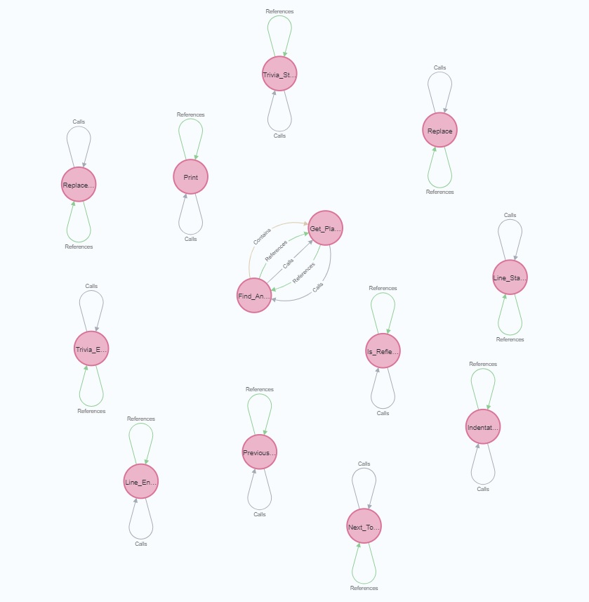
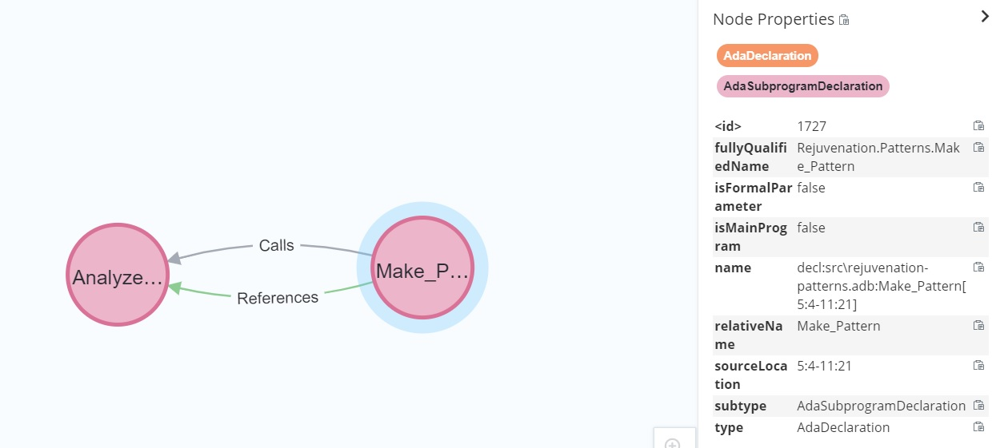

# Dependency Graph Extractor

Given one or more GPR project files, the Dependency Graph Extractor generates a GraphML file with dependency information derived from the Ada source files specified by the given project files.

## Running

Run the Dependency Graph Extractor as follows:

```
dependency_graph_extractor.exe -o output.graphml [-p directory] project_1.gpr ... project_n.gpr

 -h, --help           Display help
 -o, --output=ARG     The output GraphML file
 -p, --prefix=ARG     Directory prefix stripped from the file names in the output graph
```

The output GraphML file is required, as is at least one GPR file. If the output GraphML file already exists, it will be overwritten.

Optionally, a directory prefix can be passed to the extractor using the `-p` option. When done so, the extractor removes the prefix from every filename in the generated GraphML file. Note that, if a filename does not start with the specified prefix, it wil occur in the GraphML file as-is.

Note. Although Dependency Graph Extractor can analyse multiple projects, it can't analyze an aggregate project with more than one sub-project.

### Example

Suppose we want to extract source code dependency information from the GPR project named `rejuvenation_lib.gpr`, 
which is located in `C:\path\to\Renaissance-Ada\src\libraries\Rejuvenation_Lib`.
Moreover, suppose we do not want have the `C:\path\to\Renaissance-Ada\src\libraries\Rejuvenation_Lib` prefix occurring in the generated GraphML file.
To achieve this, we can run the Dependency Graph Extractor as follows:

```cmd
dependency_graph_extractor.exe -o rejuvenation_lib.graphml -p C:\path\to\Renaissance-Ada\src\libraries\Rejuvenation_Lib C:\path\to\Renaissance-Ada\src\libraries\Rejuvenation_Lib\rejuvenation_lib.gpr
```

Note we assume that either `dependency_graph_extractor.exe` is on the system PATH 
or the current directory is the `obj` directory of the Dependency_Graph_Extractor project.

This will create the GraphML file `rejuvenation_lib.graphml` in the current directory.

## Usage
Open the generated `graphml` file with [Neo4j](https://neo4j.com) according to [the import instructions](https://neo4j.com/labs/apoc/4.1/import/graphml/).
Note, your cypher query should resemble
```cypher
CALL apoc.import.graphml("movies.graphml", {readLabels: true})
```

Prepare yourself by reading the [Node and Edge Types](Ada_Node_and_Edge_Types.docx?raw=true) present in the graph database.

You can now interactively query the graph database using [Cypher](https://neo4j.com/developer/cypher/).
For more info on [Cypher](https://neo4j.com/developer/cypher/), 
see the [Cypher resources](https://neo4j.com/developer/cypher/resources/), including the 
[Neo4j Cypher refcard](https://neo4j.com/docs/cypher-refcard/current/).

Below, you find some example [Cypher](https://neo4j.com/developer/cypher/) queries.
Note that all example queries are rather general.
So add `LIMIT 25` to the end of the queries 
whenever your code base contains a lot of matches to still get a fast response.

### Analyze recursion

#### Find recursive functions
Run the [Cypher](https://neo4j.com/developer/cypher/) query
```cypher
MATCH (f)-[:Calls]->(f) RETURN *
```
to find all recursive functions.

#### Find all recursion
Run the [Cypher](https://neo4j.com/developer/cypher/) query
```cypher
MATCH (f)-[:Calls*]->(f) RETURN *
```
to find all recursion.



#### Find indirect recursion
Run the [Cypher](https://neo4j.com/developer/cypher/) query
```cypher
MATCH (a)-[:Calls*]->(b)-[:Calls*]->(a) RETURN *
```
to find indirect recursion only.

### Analyze references

#### Chain of references between two files
Run the [Cypher](https://neo4j.com/developer/cypher/) query
```cypher
MATCH
 p = (decl_begin:AdaDeclaration)-[:References*]->(decl_end:AdaDeclaration),
 (decl_begin)-[source_begin:Source]->(file_begin:File),
 (decl_end)-[source_end:Source]->(file_end:File)
WHERE
 file_begin.relativeName = "rejuvenation-patterns.adb" AND
 file_end.relativeName = "rejuvenation-simple_factory.ads"
RETURN p
```
to find all chains of references that 
begin with a declaration in "rejuvenation-patterns.adb" and 
end on a declaration in "rejuvenation-simple_factory.ads"



#### Number of references to declarations in file

Run the [Cypher](https://neo4j.com/developer/cypher/) query
```cypher
CALL 
{
    MATCH 
       (provider:AdaDeclaration)-[:Source]->(adsFile:AdaSpecificationFile)
    WHERE
       adsFile.name ENDS WITH "rejuvenation-string_utils.ads"
    RETURN provider
}
WITH provider,
     size (()-[:References]->(provider)) as refCount
RETURN provider.relativeName, refCount ORDER BY refCount DESC
```
to get a table of all declarations in "rejuvenation-string_utils.ads" and how often each declaration is directly referenced.

#### Refering entities to declarations in file

Run the [Cypher](https://neo4j.com/developer/cypher/) query
```cypher
MATCH 
   (provider:AdaDeclaration)-[:Source]->(adsFile:AdaSpecificationFile),
   (user)-[:References]->(provider)
WHERE
   adsFile.name ENDS WITH "rejuvenation-string_utils.ads"
RETURN user, provider
```
to get the declarations in "rejuvenation-string_utils.ads" that are referenced together with the refering entities.

## Building

### Prerequisites

The following tools are required for building the extractor:

* GNAT Pro, version 21.0 is known to work
* Python, version 3.8 is known to work
* Git, any version supported by Github works
* [langkit](https://github.com/AdaCore/langkit), the Github `master` branch is known to work
* [libadalang](https://github.com/AdaCore/libadalang), the Github `master` branch is known to work

### Build instructions
To build the Dependency Graph Extractor, we need the Ada components, langkit and libadalang.
AdaCore provides installers for these components to their customers.
Otherwise, you need to build these Ada components. 
This requires obtaining the langkit and libadalang source code, where it should be ensured that the original line endings are maintained. 
The latter can be done by setting git's `core.autocrlf` property to `false` before cloning the repositories. 
See [this Github page](https://docs.github.com/en/github/using-git/configuring-git-to-handle-line-endings) for more information.

> **NOTE**: Ensure to restore the original value of `core.autocrlf` once all steps below have been completed.

Assuming langkit and libadalang will be installed into `C:\path\to\libadalang-install`, and that we use `C:\path\to\libadalang` as scratch directory, perform the steps below from a Windows command prompt. The initial steps correspond to those that can be found in the [libadalang build instructions](https://github.com/AdaCore/libadalang/blob/master/user_manual/building.rst).

> **NOTE**: `C:\path\to\libadalang-install` should not contain any previously built copies of langkit or libadalang, otherwise the installation steps below may fail.

```cmd
set LAL_SCRATCH=C:\path\to\libadalang
set LAL_INSTALL=C:\path\to\libadalang-install

:: Clone langkit and libadalang
cd %LAL_SCRATCH%
git clone https://github.com/AdaCore/langkit/
git clone https://github.com/AdaCore/libadalang/

:: Set environment variables for GNAT Pro
set PATH=%LAL_INSTALL%\bin;%PATH%
set GPR_PROJECT_PATH=%LAL_INSTALL%\share\gpr;%GPR_PROJECT_PATH%

:: Create a Python virtual environment and install the necessary packages
python -mvenv env
env\Scripts\activate.bat
pip install -r libadalang\REQUIREMENTS.dev

:: Install the langkit Python package
cd langkit
pip install .

:: Build and install the langkit Ada components
python manage.py build-langkit-support --library-types=static,static-pic,relocatable
python manage.py install-langkit-support --library-types=static,static-pic,relocatable %LAL_INSTALL%

:: Build and install libadalang
cd ..\libadalang
python manage.py generate
python manage.py build --library-types=static,static-pic,relocatable
python manage.py install --library-types=static,static-pic,relocatable %LAL_INSTALL%

:: Deactivate the Python virtual environment
cd ..
env\Scripts\Deactivate.bat

:: Build the Dependency Graph Extractor
cd C:\path\to\Renaissance-Ada\src\tools\Dependency_Graph_Extractor
mkdir obj
gprbuild -XLIBRARY_TYPE=static -Pdependency_graph_extractor.gpr
```

The above steps result in the Dependency Graph Extractor being created as `dependency_graph_extractor.exe` 
in `cd C:\path\to\Renaissance-Ada\src\tools\Dependency_Graph_Extractor\obj`.

If up-to-date copies of langkit and libadalang already occur in `C:\path\to\libadalang-install`, the following steps will suffice to build the extractor.

```cmd
set LAL_INSTALL=C:\path\to\libadalang-install

:: Set environment variables for GNAT Pro
set PATH=%LAL_INSTALL%\bin;%PATH%
set GPR_PROJECT_PATH=%LAL_INSTALL%\share\gpr;%GPR_PROJECT_PATH%

:: Build the Dependency Graph Extractor
cd C:\path\to\Renaissance-Ada\src\tools\Dependency_Graph_Extractor
mkdir obj
gprbuild -XLIBRARY_TYPE=static -P dependency_graph_extractor.gpr
```
